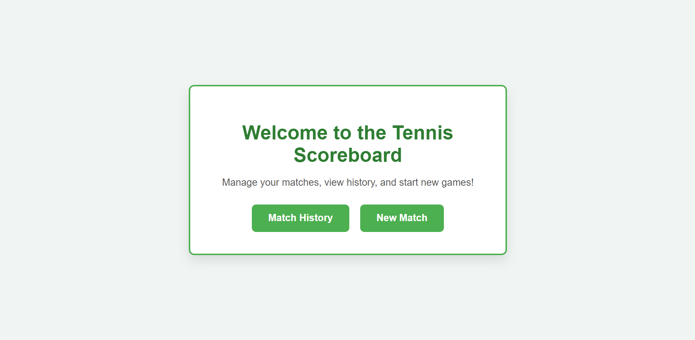
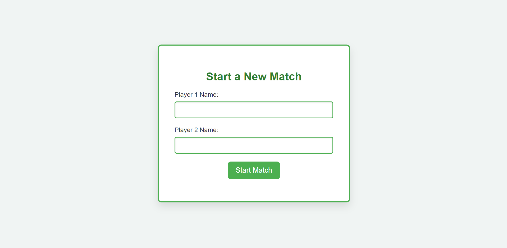
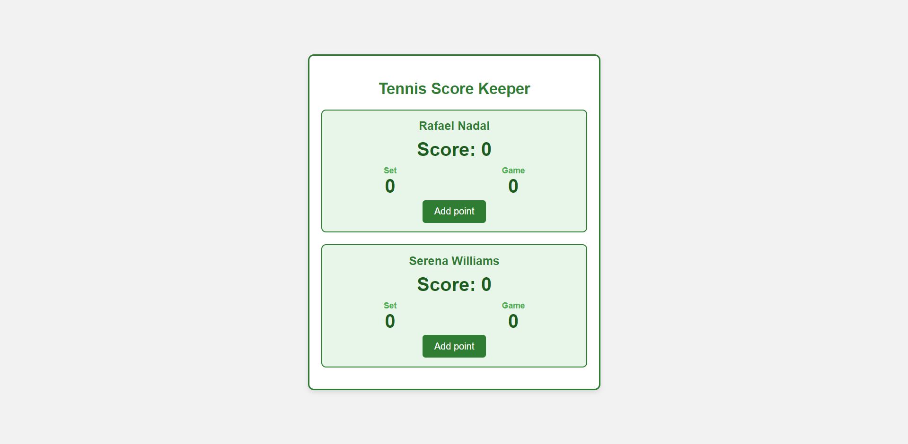
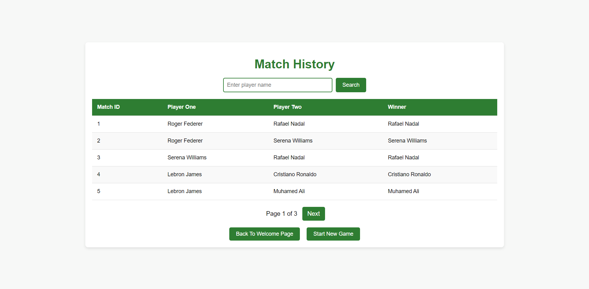

## Overview

A web application for managing tennis matches. Users can register players, track scores in real-time, and view match history. The app supports searching for matches by player names, making it easy to revisit previous games.

---
## 1. Application Features

- Register players for a tennis game.
- Track real-time scores for players.
- View match history with player name search.
---
## 2. Technologies / tools used

### Backend 

### View

### Data storage

### Testing

### Deploy

---
## 3. Pages Overview

### 3.1 Welcome page
The main landing page for the application.

---

### 3.2 Register Players page
Allows users to input players for a match.

---

### 3.3 Tennis Score Keeper Page
Tracks scores of the ongoing match in real-time.

---

### 3.4 Match History page
Displays past matches, with the ability to search by player names.

---
